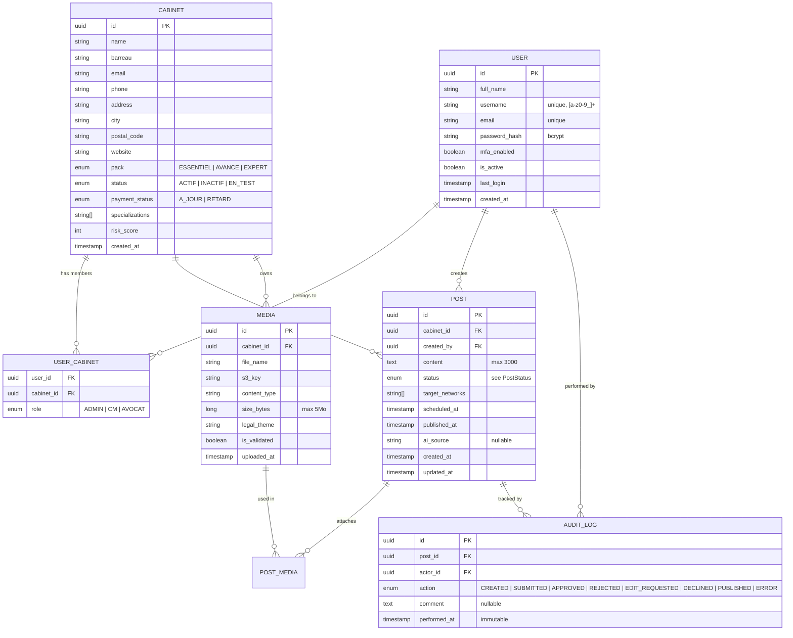
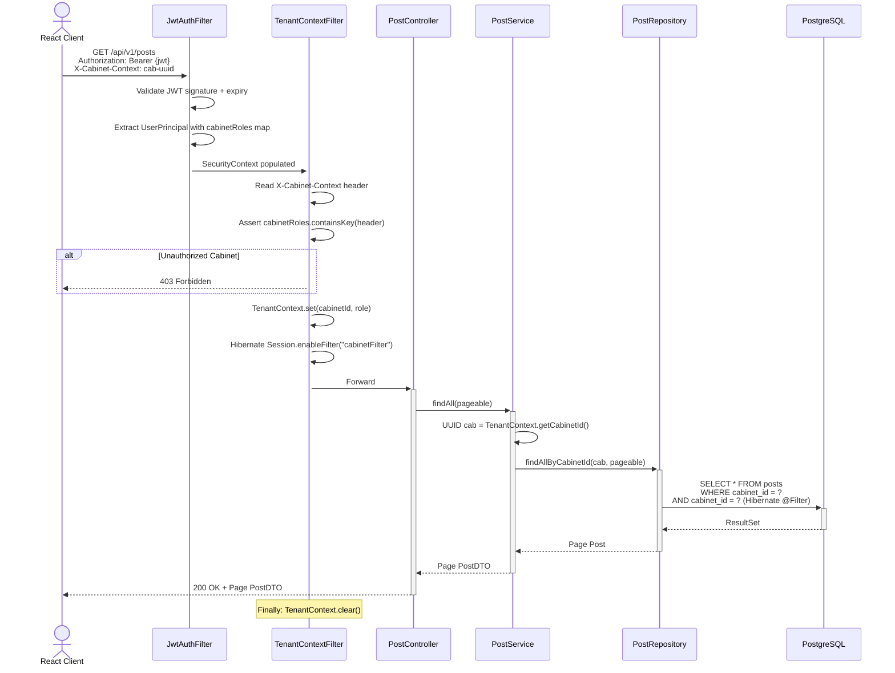
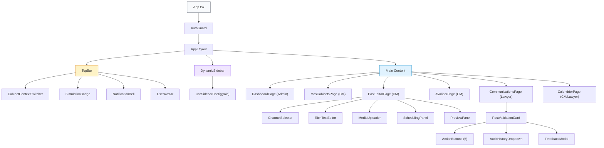
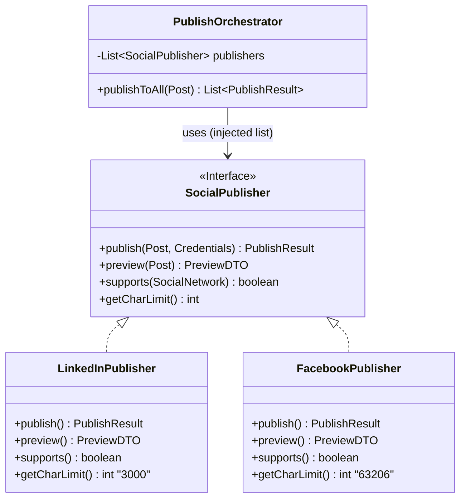

# SocialPulse — Master CDC & Technical Blueprint

> **Version:** 1.0 · **Date:** 2026-03-16  
> **Stack:** Java 21 · Spring Boot 3.x · PostgreSQL · React 18 (TS, Vite, Tailwind) · Spring Security + JWT  
> **Source of Truth:** Original CDC (15 modules) + 39 Forensic Screenshots (Admin: 14, CM: 12, Lawyer: 13)

---

# PART 1: THE THREE-MVP MASTER CDC

---

## MVP A — THE FOUNDATION (Admin / Identity)

### A.1 Authentication & User Management

**Login screen** supports 4 auth methods:
| Method | MVP Scope | Implementation |
|--------|-----------|----------------|
| Email + Password | ✅ MVP | Spring Security `AuthenticationManager` + BCrypt |
| Google OAuth2 | ✅ MVP | Spring OAuth2 Client |
| Apple Sign-In | ⛔ Phase 2 | Requires Apple Developer Program |
| Phone (SMS OTP) | ⛔ Phase 2 | Requires Twilio/equivalent |

**User creation (Admin-only modal):**
| Field | Validation | Notes |
|-------|-----------|-------|
| `fullName` | Required, 2-100 chars | "Jean Dupont" |
| `username` | Required, `[a-z0-9_]+` only | Email-like identifier |
| `password` | Required, min 8 chars | Hashed with BCrypt |
| `role` | Required, enum dropdown | `ADMIN` \| `CM` \| `AVOCAT` |

> [!IMPORTANT]
> **No self-registration.** "Les comptes sont créés par l'administrateur SocialPulse." Accounts are provisioned top-down. The login page has "Contactez-nous" instead of "Sign up."

**JWT Payload:**
```json
{
  "sub": "user-uuid",
  "email": "user@socialpulse.fr",
  "roles": { "cabinet-uuid-1": "CM", "cabinet-uuid-2": "CM" },
  "activeCabinetId": "cabinet-uuid-1",
  "isSimulating": false,
  "iat": 1710000000,
  "exp": 1710086400
}
```

### A.2 Multi-Tenancy Architecture

**Core rule:** A `User` belongs to one or more `Cabinets` via the `UserCabinet` join table. The role is **per-cabinet**, not global.

| Role | Cabinet Scope | Capabilities |
|------|--------------|-------------|
| `ADMIN` | All cabinets (global) | Full CRUD on users, cabinets, billing; access to KPI SaaS, Pipeline |
| `CM` | 1..N assigned cabinets | Switch between cabinets; create/edit/submit posts; manage media |
| `AVOCAT` | Exactly 1 cabinet | Validate/reject posts; view calendar; contact CM via support |

**Admin sidebar (observed from 14 screenshots):**
```
OPÉRATIONS: Vue d'ensemble, Cabinets, Utilisateurs, Prises de parole, CM & Activité
BUSINESS: Vue d'ensemble, Revenus & MRR, Facturation, Acquisition & Pipeline, Rétention & Churn, KPIs SaaS
COORDINATION: Centre de coordination
CONFORMITÉ: Vue d'ensemble, Journal d'activité
PARAMÈTRES: Paramètres compte, Déconnexion
```

### A.3 Global Rules & GDPR

| Rule | Specification |
|------|--------------|
| HTTPS/TLS | Enforced; HSTS headers on all responses |
| Rate Limiting | 5 failed login attempts → 15-min lockout |
| MFA | Optional TOTP (Phase 2) |
| RGPD | Right to erasure: `DELETE /api/v1/users/{id}` cascades to all data |
| Audit Trail | Append-only `audit_logs` table; immutable, never deleted |
| Password Storage | BCrypt (cost=12) or Argon2id |

### A.4 Organization Seeding Process

```sql
-- 1. Create the SocialPulse organization (root tenant)
INSERT INTO organizations (id, name) VALUES (gen_random_uuid(), 'SocialPulse');

-- 2. Create the first Admin user
INSERT INTO users (id, full_name, email, password_hash, is_active)
VALUES (gen_random_uuid(), 'Super Admin', 'admin@socialpulse.fr', '$2a$12$...', true);

-- 3. Create demo cabinet
INSERT INTO cabinets (id, name, barreau, city, postal_code, pack, status)
VALUES (gen_random_uuid(), '[DEMO] Cabinet Stagiaire & Associés', 'Barreau de Paris', 'Paris', '75008', 'ESSENTIEL', 'ACTIF');

-- 4. Assign Admin to all cabinets
INSERT INTO user_cabinets (user_id, cabinet_id, role) VALUES (:adminId, :cabinetId, 'ADMIN');
```

---

## MVP B — THE PRODUCER (Community Manager)

### B.1 The Workspace — Cabinet Switching

**"Mes Cabinets" page** displays a filterable card grid:
| Field | Source |
|-------|--------|
| Cabinet name | `Cabinet.name` |
| Barreau (Bar Association) | `Cabinet.barreau` |
| Status badge | `ACTIF` (green) / `INACTIF` (grey) / `ATTENTION REQUISE` (orange) |
| Address | `Cabinet.city` + `Cabinet.postalCode` |
| Contact | `Cabinet.email` + `Cabinet.phone` |
| Specializations | `Cabinet.specializations[]` → tag chips |
| ⚙️ Settings gear | Navigate to `Paramètres du cabinet` (read-only for CM) |
| "Sélectionné" button | Sets `activeCabinetId` → `POST /api/v1/auth/switch-cabinet` |

**Filters:** Barreau (dropdown), Statut (dropdown), Spécialisation (dropdown).

### B.2 Editorial Core — Post CRUD

**"Nouvelle prise de parole" (Post Editor):**

| Component | Fields / Behavior |
|-----------|------------------|
| **Channel Selector** | Toggle grid: LinkedIn, Instagram, Facebook, X(Twitter), Google Business. Multi-select. |
| **Assistance buttons** | "Depuis un lien" (import), "Assistance rédactionnelle" (AI — Phase 2) |
| **Rich Text Editor** | Bold, Italic, Strikethrough, List, Emoji. Character counter: 0 / Max 3000 |
| **Platform Warning** | "Les options barrées ne sont pas supportées par [network]" |
| **Image Upload** | Drag & drop zone, max 5 Mo. "Générer avec l'IA" button (Phase 2) |
| **Scheduling** | Date picker + Time picker |
| **Status dropdown** | `Brouillon` (DRAFT) by default |
| **Actions** | "Sauvegarder (5)" → save draft \| "Programmer (5)" → set SCHEDULED |

**API — `POST /api/v1/posts`:**
```json
{
  "content": "Garde alternée : les critères pris en compte par le juge...",
  "targetNetworks": ["LINKEDIN", "FACEBOOK"],
  "scheduledAt": "2026-03-23T11:00:00",
  "mediaIds": ["media-uuid"],
  "status": "DRAFT"
}
```

### B.3 Workflow — The CM Review Gate ("À valider")

**"Publications à valider avant envoi au cabinet"** — CM reviews AI-generated or drafted content before sending to Lawyer.

| Banner | "Revue CM avant envoi à l'avocat. Vérifiez le contenu généré par l'IA, modifiez si nécessaire, puis approuvez pour envoyer à l'avocat." |
|--------|---|

**Post card actions (CM view):**
| Button | State Transition | Endpoint |
|--------|-----------------|----------|
| **Approuver et envoyer** | `PENDING_CM` → `PENDING_LAWYER` | `PUT /api/v1/posts/{id}/submit` |
| **Modifier** | Opens Post Editor (in-place) | `PUT /api/v1/posts/{id}` |
| **Rejeter** | `PENDING_CM` → `REJECTED` (rare, for AI junk) | `PATCH /api/v1/posts/{id}/reject` |
| **Aperçu** | Opens PreviewPane modal (no state change) | Client-side only |

> [!WARNING]
> **The CM has a TWO-STEP approval.** The CM first validates content (especially AI-generated), THEN sends to Lawyer. This means `PENDING_CM` is a distinct state from `DRAFT` — it implies the content came from an external source (AI, imported link).

---

## MVP C — THE VALIDATOR (Lawyer / Avocat)

### C.1 The Review Gate — "Communications en attente"

**Header:** "3 prises de parole à valider avant diffusion"  
**Legal banner:** _"Aucune publication sans validation explicite de l'avocat. Vous gardez le contrôle total sur chaque communication diffusée au nom de votre cabinet."_

**Filters:** `Tout` | `Urgent` | `Aujourd'hui` | `Cette semaine` | `Expirés`  
**Tabs:** `Tout` (3) | `Réseaux sociaux` (3) | `Blog` (0)

**Post card actions (Lawyer view):**
| Button | Color | State Transition | Endpoint |
|--------|-------|-----------------|----------|
| **Valider** | 🟢 Green | `PENDING_LAWYER` → `APPROVED` | `PATCH /api/v1/posts/{id}/approve` |
| **Modifier** | ⚪ Grey | Opens inline editor | `PUT /api/v1/posts/{id}` |
| **Demander modification** | ⚪ Grey | `PENDING_LAWYER` → `PENDING_CM` + comment | `POST /api/v1/posts/{id}/request-edit` |
| **Refuser** | 🔴 Red | `PENDING_LAWYER` → `REJECTED` | `PATCH /api/v1/posts/{id}/reject` |
| **Décliner pour...** | ⚪ Grey | `PENDING_LAWYER` → `PENDING_CM` + reason | `POST /api/v1/posts/{id}/decline` |
| **Aperçu** | 👁 Icon | Preview in network-specific frame | Client-side |
| **Historique ▼** | Dropdown | Expand audit trail | Client-side |

### C.2 Lawyer Sidebar & Legal Content

```
CONTENU: Calendrier, Communications, Blog, Médiathèque
CANAUX: Google Business, Emailing
ANALYSE: Performances, Actualités juridiques
SUPPORT: Conseiller éditorial (→ Mon CM hub)
```

**"Opportunités éditoriales"** (Calendar sidebar):
- `Audience CNIL - Sanction majeure` · 20 mars · `Opportune`
- `Arrêt Cour de cassation - Bail commercial` · 5 avr · `Opportune`
- `Conseil constitutionnel - QPC fiscale` · 10 mai · `Opportune`

### C.3 Support Hub — "Mon CM" (Lawyer view)

| Section | Description |
|---------|------------|
| CM Profile Card | Name, specialty, online status, response time |
| Base de réponses | 15 FAQ articles |
| Messagerie | Live chat with CM ("CM en ligne" badge) |
| Statistiques | Support performance metrics |
| Prendre rendez-vous | Calendar booking ("Créneaux disponibles") |

---

# PART 2: TECHNICAL CONCEPTION

---

## 1. Master ERD



## 2. Post Lifecycle — The Core State Machine

```mermaid
stateDiagram-v2
    direction LR

    [*] --> DRAFT: CM creates post
    DRAFT --> PENDING_CM: AI generates content OR import

    state "CM Review" as cmr {
        PENDING_CM --> PENDING_LAWYER: CM Approuver et envoyer
        PENDING_CM --> REJECTED: CM Rejeter (bad AI content)
    }

    DRAFT --> PENDING_LAWYER: CM direct submit (no AI)

    state "Lawyer Review" as lr {
        PENDING_LAWYER --> APPROVED: Valider
        PENDING_LAWYER --> REJECTED: Refuser
        PENDING_LAWYER --> PENDING_CM: Demander modification
        PENDING_LAWYER --> PENDING_CM: Décliner pour...
    }

    state "System Publish" as sp {
        APPROVED --> SCHEDULED: scheduledAt set
        APPROVED --> PUBLISHED: immediate publish
        SCHEDULED --> PUBLISHED: Scheduler fires at scheduledAt
        SCHEDULED --> ERROR: Social API failure
        ERROR --> SCHEDULED: Retry (max 3)
    }

    REJECTED --> [*]
    PUBLISHED --> [*]
```

## 3. Tenant Isolation — Sequence Diagram



## 4. React Component Hierarchy



---

# PART 3: IMPLEMENTATION STRATEGY

---

## 1. Sprint Backlog — First 10 GitHub Issues

| # | Issue Title | Type | Priority | MVP | Points |
|---|-------------|------|----------|-----|--------|
| 1 | `[AUTH] Implement JWT login with email/password` | Feature | P0 | A | 5 |
| 2 | `[AUTH] Add Google OAuth2 login flow` | Feature | P0 | A | 3 |
| 3 | `[SECURITY] Implement TenantContextFilter with ThreadLocal` | Feature | P0 | A | 8 |
| 4 | `[ADMIN] User CRUD with role assignment per cabinet` | Feature | P0 | A | 5 |
| 5 | `[ADMIN] Cabinet CRUD with seeding script` | Feature | P1 | A | 3 |
| 6 | `[CM] POST /api/v1/posts — Create draft with media` | Feature | P0 | B | 8 |
| 7 | `[CM] Cabinet switching (switch-cabinet endpoint)` | Feature | P0 | B | 3 |
| 8 | `[CM] "À valider" page — CM review & submit to Lawyer` | Feature | P0 | B | 5 |
| 9 | `[LAWYER] Communications en attente — Approve/Reject/Request Edit` | Feature | P0 | C | 8 |
| 10 | `[INFRA] Hibernate @Filter + ArchUnit CI enforcement` | Tech Debt | P0 | A | 5 |

**Velocity estimate:** ~54 story points → ~2 sprints (2-week each) for a 2-dev team.

## 2. Testing Strategy — TenantInterceptor (FIRST Principles)

```java
@SpringBootTest
@AutoConfigureMockMvc
class TenantContextFilterTest {

    @Autowired private MockMvc mockMvc;
    @Autowired private JwtTokenProvider tokenProvider;

    // FAST — No real DB, MockMvc only
    // INDEPENDENT — Each test creates its own JWT
    // REPEATABLE — No external state
    // SELF-VALIDATING — Clear assertions
    // TIMELY — Written BEFORE the filter implementation

    @Test
    @DisplayName("Returns 403 when CM requests a cabinet they don't belong to")
    void shouldBlock_whenCabinetNotInJwt() throws Exception {
        String jwt = tokenProvider.createToken("cm-user", Map.of("cab-A", "CM"));

        mockMvc.perform(get("/api/v1/posts")
                .header("Authorization", "Bearer " + jwt)
                .header("X-Cabinet-Context", "cab-B"))  // NOT in token
            .andExpect(status().isForbidden());
    }

    @Test
    @DisplayName("Sets TenantContext when cabinet is valid")
    void shouldSetContext_whenCabinetValid() throws Exception {
        String jwt = tokenProvider.createToken("cm-user", Map.of("cab-A", "CM"));

        mockMvc.perform(get("/api/v1/posts")
                .header("Authorization", "Bearer " + jwt)
                .header("X-Cabinet-Context", "cab-A"))
            .andExpect(status().isOk());
    }

    @Test
    @DisplayName("Blocks write actions when Simulation mode is active")
    void shouldBlockWrites_whenSimulating() throws Exception {
        String jwt = tokenProvider.createToken("cm-user",
            Map.of("cab-A", "CM"), true); // isSimulating=true

        mockMvc.perform(patch("/api/v1/posts/123/approve")
                .header("Authorization", "Bearer " + jwt)
                .header("X-Cabinet-Context", "cab-A"))
            .andExpect(status().isForbidden());
    }
}
```

## 3. SOLID Integration — Strategy Pattern for Social APIs



```java
@Service
@RequiredArgsConstructor
public class PublishOrchestrator {

    private final List<SocialPublisher> publishers; // Spring auto-injects all implementations

    public List<PublishResult> publishToAll(Post post) {
        return post.getTargetNetworks().stream()
            .map(network -> publishers.stream()
                .filter(p -> p.supports(network))
                .findFirst()
                .orElseThrow(() -> new UnsupportedNetworkException(network))
                .publish(post, credentialService.getFor(network, post.getCabinet())))
            .toList();
    }
}
```

> **Open/Closed Principle:** Adding Instagram = create `InstagramPublisher implements SocialPublisher`, annotate with `@Component`. Zero changes to `PublishOrchestrator`.

---

## 🔬 Forensic Gap — The One Detail Easy to Miss

> [!CAUTION]
> **Simulation Mode Is a Read-Only Impersonation, NOT a Role Switch**
>
> The `Vue : Avocat` + `Simulation` toggle lets a CM preview the Lawyer experience. But the "Approuver et envoyer" button is STILL visible in simulation mode. If the backend doesn't enforce `isSimulating == true → block all PATCH/PUT/POST`, a CM in simulation mode could approve their own post, bypassing the Lawyer entirely.
>
> **MVP Rule:** Add `@SimulationReadOnly` custom annotation on all state-transition endpoints. The `TenantContextFilter` checks `jwt.isSimulating` and returns `403` for any non-GET request.

---

## Complexity Audit — Final Risk Matrix

| Component | Risk | Effort | Rationale |
|-----------|------|--------|-----------|
| Tenant Isolation | 🔴 Critical | 8 pts | One missed `findAll()` = GDPR breach across law firms |
| Post State Machine | 🔴 High | 8 pts | 8 states, 3 actors, race conditions |
| Simulation Mode | 🟡 Medium | 5 pts | Server-side enforcement required |
| JWT + OAuth2 | 🟡 Medium | 5 pts | Standard but must carry `cabinetRoles` map |
| Media Upload (S3) | 🟢 Low | 3 pts | Well-documented pattern |
| Calendar View | 🟢 Low | 3 pts | FullCalendar.js handles complexity |
| Facturation / Pipeline | ⛔ Phase 2 | — | Out of MVP scope |
